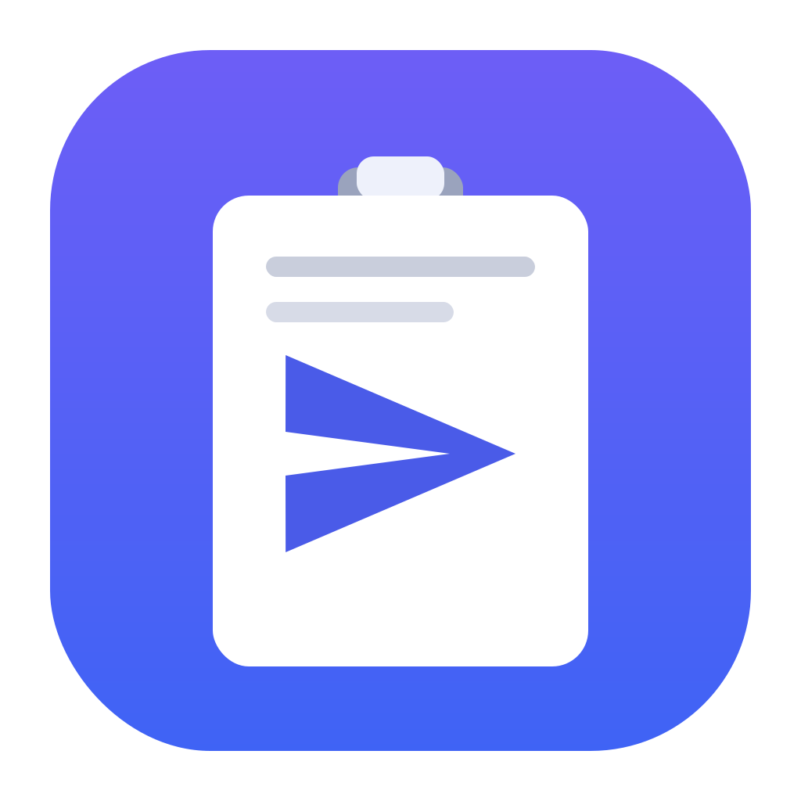
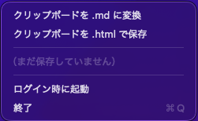

<p align="center">
  
</p>

<h1 align="center">ClipFeed</h1>

<p align="center"><em>Convert clipboard rich text to clean Markdown (or full HTML) and put the file back on your clipboard — built for sharing with AI.</em></p>

---

クリップボードのリッチコンテンツ（Web からコピーした HTML など）を **Markdown(.md)** に変換し、
`~/Downloads` に保存したうえで、その **.md ファイルをそのままクリップボードに載せ直す**
macOS メニューバー常駐アプリ。

AI（Claude デスクトップアプリ / Claude Code 等）へ「テキストをコピペ」ではなく
「ファイルで渡す」ことで、コンテキストを節約しつつ表・見出し・リストの構造を保ったまま共有できる。

## スクリーンショット

<p align="center">
  
</p>

## 使い方

1. Web ページなどで内容をコピー（⌘C）
2. メニューバーの 📄 アイコンから、2つのモードを選ぶ:
   - **「クリップボードを .md に変換」** … AI 共有向け。画像を除去した軽量な Markdown
   - **「クリップボードを .html で保存」** … 構造を一切落としたくないとき。元の HTML をそのまま保存
3. `~/Downloads/clip-YYYYMMDD-HHMMSS.md`（または `.html`）が生成され、クリップボードがそのファイルに切り替わる
4. 貼り付け先で ⌘V
   - **Claude デスクトップアプリ** → ファイルが添付される
   - **ターミナル（Claude Code 等）** → ファイルの絶対パスが入力される

## 2つのモード

| モード | 出力 | 処理内容 | 用途 |
|--------|------|----------|------|
| 軽量MD | `.md` | 同梱の **turndown（WKWebView 上で実行）** で GFM に変換（div/span/style/生HTMLを除去）後、**画像 ``（base64含む）を除去**・空リンク/孤立改行/余分な空行を整理 | AIへのテキスト共有。トークン節約 |
| 完全HTML | `.html` | クリップボードの HTML を最小ドキュメントに包んでそのまま保存 | 表・構造を完全に保持したいとき |

> 実測例（ある商品一覧ページ）: 軽量MDで **65KB → 37KB（約43%減）**、画像107個・base64 4個を全除去。表とテキストリンクは保持。
>
> 注: 軽量MDは「画像の除去」のみ。ナビ/フッター等の*テキスト*は残る（本文抽出はしない）。

## 仕組み

- クリップボードの `public.html` を読み取り、**同梱した turndown.js を WKWebView 上で実行**して GFM(Markdown) に変換
  （HTML が無くプレーンテキストだけの時はそのまま保存。外部依存なしの自己完結）
- CLI 変換も可能: `ClipFeed.app/Contents/MacOS/ClipFeed --convert <file.html>` で Markdown を標準出力
- 軽量MDモードでは変換後に画像除去などのテキスト整形（`cleanMarkdown`）を実施
- 生成したファイルを `~/Downloads` に書き出し
- クリップボードに 1 つの `NSPasteboardItem` を載せる
  - `public.file-url`：ファイル本体（添付用）
  - 文字列：POSIX 絶対パス（ターミナル貼り付け用）

## 必要環境

- macOS 13 以降（ログイン項目登録に `SMAppService` を使用）
- **実行に追加インストール不要**（変換用の turndown を同梱した自己完結アプリ。約450KB）
- ビルドに Xcode Command Line Tools（`swiftc`）

## ビルド

```bash
git clone https://github.com/asterisk3157/ClipFeed.git
```

```bash
cd ClipFeed && ./build.sh
```

`ClipFeed.app` が生成される。`/Applications` に置いて常用する場合（リポジトリ直下で）：

```bash
cp -R ClipFeed.app /Applications/
```

## アイコン

- ソース: `icon.svg`（編集可能）
- `./make-icon.sh` で `icon.svg` → `AppIcon.icns` を再生成（macOS 標準の QuickLook で描画するため追加インストール不要）
- `build.sh` が `AppIcon.icns` を自動的にバンドルへ取り込む

```bash
./make-icon.sh
```

## 自動起動（ログイン時）

メニューバーのメニューから **「ログイン時に起動」** をクリックするだけで ON/OFF できる
（`ServiceManagement` / `SMAppService` を使用。チェックが付けば有効）。

- 初回 ON 時に macOS の承認が必要な場合は、自動でシステム設定のログイン項目が開く
- ログイン項目に登録される実体は「その時起動していた .app のパス」。
  パスが変わると無効になるので、**`/Applications` に置いてから ON にする**のが安定（macOS 13 以降が必要）

## 既知の注意点

- 初回実行時、`~/Downloads` へのアクセス許可ダイアログが出ることがある（許可で OK）
- 貼り付け先がファイル添付に対応していないテキスト欄では、絶対パス文字列が貼られる
- ローカルビルド（アドホック署名）のため、配布された `.app` を初回起動する際は Gatekeeper の確認が出る場合がある

## ライセンス

[MIT License](LICENSE)
